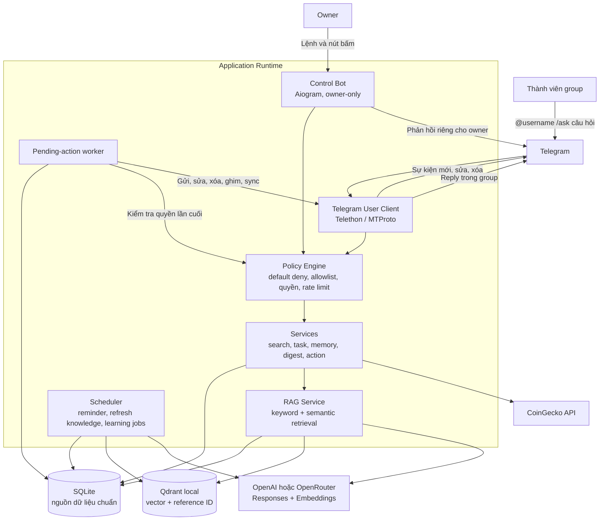
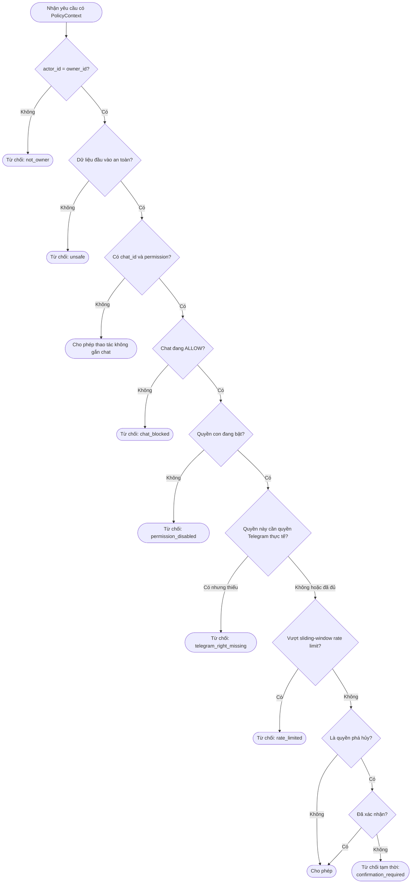
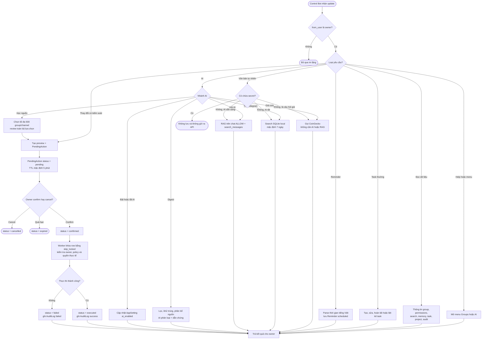
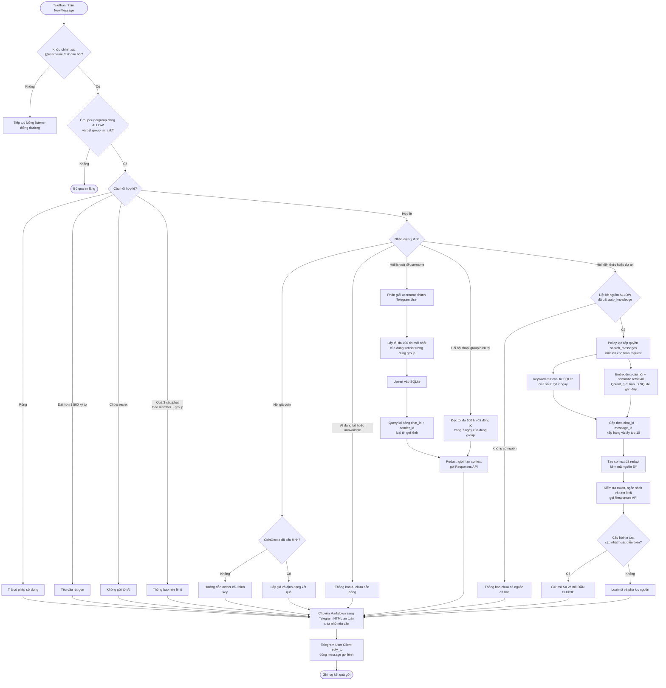
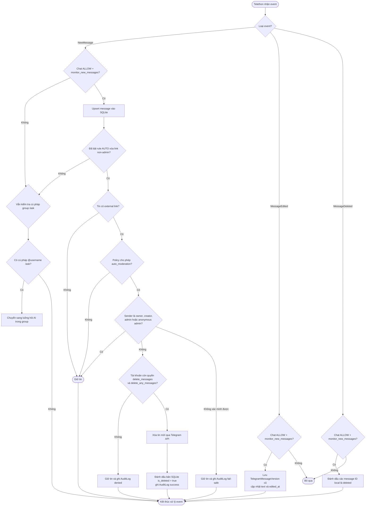
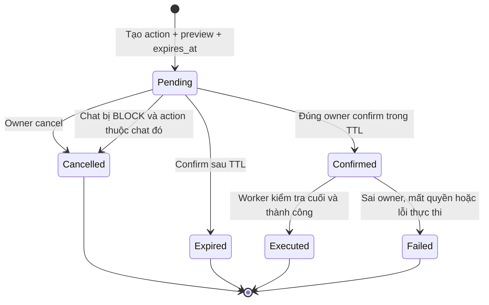

# Sơ đồ hoạt động chi tiết

Tài liệu này mô tả luồng chạy thực tế của dự án `Telegram AI Personal Assistant`,
dựa trên các entry point trong `cli.py`, bộ điều phối `runtime.py`, hai giao diện
Telegram và các service hiện có.

## Ký hiệu

- SQLite là nguồn dữ liệu chuẩn và mỗi database context tự `commit`; khi có lỗi sẽ
  `rollback`.
- Qdrant local chỉ là chỉ mục vector dẫn về bản ghi SQLite.
- Đường đi qua `PendingAction` có nghĩa là owner phải xem trước và xác nhận trước
  khi worker thực thi.
- Chat mặc định là `BLOCK`. Một thao tác trên chat chỉ được tiếp tục khi chat ở
  `ALLOW`, quyền con được bật và quyền Telegram thực tế còn hợp lệ.

## 1. Toàn cảnh hoạt động của hệ thống

## 2. Khởi động, ghép nối và vòng đời tiến trình

```mermaid
flowchart TD
    a0(["Người dùng chạy tg-assistant start hoặc run"]) --> ready["Kiểm tra cấu hình và thư mục runtime"]
    ready --> db_secret{"Profile đã có SQLite?"}
    db_secret -->|"Chưa"| setup["Tạo SQLite rỗng trong profile<br/>chạy migration dưới khóa ghi"]
    db_secret -->|"Rồi"| tg_secret
    setup --> tg_secret{"Đủ API ID, API hash,<br/>phone và bot token?"}
    tg_secret -->|"Chưa"| prompt["Nhập secret ẩn trong terminal"]
    tg_secret -->|"Đủ"| ai_secret
    prompt --> ai_secret{"Provider AI đang bật<br/>nhưng thiếu API key?"}
    ai_secret -->|"Có"| prompt_ai["Chọn provider và nhập key ẩn"]
    ai_secret -->|"Không"| coin_secret
    prompt_ai --> coin_secret{"Thiếu CoinGecko key?"}
    coin_secret -->|"Có"| prompt_coin["Nhập CoinGecko key ẩn"]
    coin_secret -->|"Không"| session_check
    prompt_coin --> session_check{"Có session mã hóa<br/>và owner đã paired?"}

    session_check -->|"Chưa"| bootstrap["Bootstrap Telethon<br/>OTP hoặc 2FA chỉ nhập tại terminal"]
    bootstrap --> verify_bot["Xác minh bot token và lấy username"]
    verify_bot --> discover_first["Đọc metadata dialog<br/>không đọc nội dung chat bị BLOCK"]
    discover_first --> pair_code["Sinh mã pairing một lần<br/>TTL 5 phút"]
    pair_code --> pair_wait{"Owner gửi /pair đúng mã<br/>từ đúng Telegram user?"}
    pair_wait -->|"Sai hoặc hết hạn"| pair_fail(["Dừng bootstrap với lỗi"])
    pair_wait -->|"Đúng"| paired["Đánh dấu is_owner_paired = true"]
    paired --> launch
    session_check -->|"Đủ"| launch{"Chạy foreground hay background?"}

    launch -->|"start"| instance_bg["Kiểm tra PID cũ<br/>giữ instance lock<br/>tạo worker nền"]
    launch -->|"run"| instance_fg["Giữ instance lock<br/>chạy trong terminal"]
    instance_bg --> app_init
    instance_fg --> app_init["Khởi tạo Database, Policy, AI,<br/>CoinGecko, Qdrant và Scheduler"]

    app_init --> auth["Telethon authenticate"]
    auth --> paired_check{"Account tồn tại<br/>và đã paired?"}
    paired_check -->|"Không"| runtime_fail(["Từ chối khởi động"])
    paired_check -->|"Có"| discover["Cập nhật metadata dialog"]
    discover --> recover["Đưa learning job bị gián đoạn<br/>về trạng thái queued"]
    recover --> register["Đăng ký handler Telethon và Aiogram"]
    register --> start_scheduler["Khởi động scheduler"]

    start_scheduler --> parallel{{"Chạy song song"}}
    parallel --> bot_poll["Control Bot polling"]
    parallel --> mtproto["Telegram User Client<br/>run_until_disconnected"]
    parallel --> pending_loop["Pending-action worker<br/>poll mỗi 2 giây"]
    parallel --> reminders["Reminder job<br/>mỗi 30 giây"]
    parallel --> refresh["Knowledge refresh<br/>mỗi 5 phút"]
    parallel --> learning["Learning job worker<br/>mặc định mỗi 2 giây"]

    bot_poll --> stop_wait
    mtproto --> stop_wait
    pending_loop --> stop_wait
    reminders --> stop_wait
    refresh --> stop_wait
    learning --> stop_wait{"SIGINT, SIGTERM,<br/>stop.request hoặc lỗi dừng?"}
    stop_wait -->|"Chưa"| parallel
    stop_wait -->|"Có"| shutdown["Cancel task và dừng scheduler"]
    shutdown --> close["Đóng bot, CoinGecko, Qdrant và database<br/>mã hóa lại Telethon session"]
    close --> cleanup["Xóa PID và started_at"]
    cleanup --> done(["Dừng an toàn"])
```

## 3. Cổng kiểm soát Policy Engine

Luồng này được dùng cho các thao tác đọc/ghi trên chat. Với truy vấn đọc nhiều
nguồn, hệ thống kiểm tra owner và rate limit một lần rồi lọc toàn bộ Chat ID được
phép; không trừ rate limit riêng cho từng nguồn.

Khi owner chuyển một chat sang `BLOCK`, hệ thống tắt ngay toàn bộ quyền con, xử lý
memory theo lựa chọn `keep`, `archive` hoặc `delete`, đồng thời hủy các pending
action khác của chat đó.

## 4. Control Bot và các nhóm chức năng

Các thay đổi đi qua `PendingAction` gồm gửi/sửa/xóa/ghim tin, thay allowlist hoặc
quyền, áp dụng template, thiết lập moderation, bật/tắt group AI, đồng bộ lịch sử,
học nguồn, tạo/quên memory và xóa task. Task thủ công thông thường và reminder
được ghi trực tiếp bởi owner.

## 5. Thành viên trong group hỏi AI

## 6. Học dữ liệu group/channel và duy trì knowledge corpus

```mermaid
flowchart TD
    k0(["Owner mở Học từ group/channel"]) --> select["Chọn từng nguồn, cả trang, tìm kiếm<br/>hoặc chọn tất cả; tối đa 500 nguồn"]
    select --> review["Xem lại danh sách và phạm vi dữ liệu"]
    review --> pending["Tạo enable_group_learning_bulk<br/>PendingAction"]
    pending --> confirm{"Owner xác nhận trong TTL?"}
    confirm -->|"Không"| stop(["Hủy hoặc hết hạn, không tạo job"])
    confirm -->|"Có"| action_worker["Pending-action worker nhận action confirmed"]
    action_worker --> validate["Lọc Chat ID hợp lệ<br/>group, supergroup hoặc channel"]
    validate --> enqueue["Mỗi nguồn tạo một BackgroundJob learn_group<br/>status = queued, max_attempts = 3"]
    enqueue --> inventory["KnowledgeSource status = queued"]

    inventory --> poll["Learning worker lấy job cũ nhất<br/>FOR UPDATE SKIP LOCKED"]
    poll --> stale{"Có job running quá 15 phút?"}
    stale -->|"Có"| requeue_stale["Đưa lại queued và xóa lock"]
    stale -->|"Không"| lock
    requeue_stale --> lock["Chuyển một job queued sang running<br/>tăng attempts và đặt locked_at"]

    lock --> phase1["Pha 1: SQLite là nguồn chuẩn"]
    phase1 --> policy["Bật ALLOW + template knowledge"]
    policy --> sync["Telethon sync tối đa 1.000 tin<br/>chỉ ID mới hơn SyncState checkpoint"]
    sync --> upsert["Upsert theo chat_id + message_id<br/>lưu version nếu nội dung đã sửa"]
    upsert --> counts["Đếm message và message có text"]
    counts --> commit["Commit transaction SQLite"]

    commit --> phase2["Pha 2: tạo dữ liệu dẫn xuất"]
    phase2 --> checkpoint["Đọc knowledge_checkpoint của nguồn"]
    checkpoint --> rows["Lấy text chưa xóa, ID lớn hơn checkpoint<br/>bỏ nội dung giống secret"]
    rows --> batch["Chia batch theo giới hạn item và token"]
    batch --> budget{"AI, embedding và ngân sách sẵn sàng?"}
    budget -->|"Không hoặc lỗi"| job_error
    budget -->|"Có"| embed["Embeddings API<br/>rate limit có chờ"]
    embed --> qdrant["Upsert batch vào collection telegram_messages<br/>kèm chat_id, message_id"]
    qdrant --> update_cp["Cập nhật checkpoint đến ID mới nhất"]
    update_cp --> complete["Job = completed<br/>KnowledgeSource = learned hoặc no_content"]

    job_error["Lưu lỗi và giải phóng lock"] --> attempts{"Đã đủ 3 lần thử?"}
    attempts -->|"Chưa"| retry["Job = queued<br/>run_after lùi 1 đến 5 phút"]
    retry --> poll
    attempts -->|"Rồi"| failed(["Job = failed<br/>giữ nguyên dữ liệu SQLite đã commit"])
    complete --> more{"Còn job queued?"}
    more -->|"Có"| poll
    more -->|"Không"| idle(["Chờ chu kỳ tiếp theo"])

    subgraph continuous["Refresh liên tục mỗi 5 phút"]
        r0["Kiểm tra AI, vector store và knowledge lock"] --> backlog{"Còn learning backlog?"}
        backlog -->|"Có"| defer["Hoãn refresh"]
        backlog -->|"Không"| learned_sources["Lấy nguồn ALLOW + auto_knowledge"]
        learned_sources --> recent["Mỗi nguồn lấy tối đa 100 row<br/>sau knowledge checkpoint"]
        recent --> r_embed["Embedding + upsert Qdrant"]
        r_embed --> r_cp["Cập nhật checkpoint"]
    end

    idle --> r0
```

Nếu tiến trình bị dừng khi job đang chạy, job được trả về `queued`. Khi khởi động
lại, runtime cũng phục hồi toàn bộ learning job dở dang trước khi nhận traffic.

## 7. Listener Telegram, đồng bộ và AUTO moderation

AUTO moderation chỉ áp dụng cho tin **mới** sau khi owner đã xác nhận bật standing
authorization. Luồng quét và xóa tin cũ trong Control Bot vẫn tạo preview và cần
xác nhận riêng cho từng tin.

## 8. Vòng đời PendingAction

Worker chỉ lấy tối đa 10 action `confirmed` theo thứ tự xác nhận và dùng row lock
`skip_locked`. Trước thao tác Telegram, worker đọc lại quyền thực tế; do đó một
quyền đã bị thu hồi sau lúc owner bấm xác nhận vẫn làm action thất bại an toàn.

## 9. Scheduler và worker nền

| Chu kỳ | Thành phần | Hoạt động chính |
|---|---|---|
| Liên tục | Control Bot | Poll update riêng của owner và điều phối lệnh/FSM |
| Liên tục | Telegram User Client | Nghe tin mới, sửa, xóa và lệnh hỏi AI trong group |
| 2 giây | Pending-action worker | Thực thi action đã xác nhận, cập nhật trạng thái và audit |
| 30 giây | Reminder dispatcher | Khóa tối đa 20 reminder đến hạn, gửi owner, đánh dấu sent/failed |
| Mặc định 2 giây | Learning worker | Lấy một job học, sync SQLite rồi embedding vào Qdrant |
| 5 phút | Knowledge refresh | Bổ sung tối đa 100 message mới mỗi nguồn đã học |

## 10. Điểm dừng an toàn quan trọng

1. Người lạ nhắn Control Bot không nhận được thông tin trạng thái hệ thống.
2. Chat `BLOCK` không được đọc nội dung, tìm kiếm, đồng bộ hoặc thực thi action.
3. Secret bị chặn trước khi lưu memory, tạo action gửi tin hoặc gọi AI; tìm kiếm
   keyword local không gửi nội dung ra dịch vụ bên ngoài.
4. AI bị tắt, hết ngân sách hoặc lỗi không làm dừng tìm kiếm SQLite, task, reminder
   hay moderation local.
5. SQLite được commit trước khi embedding; lỗi API không làm mất dữ liệu đã sync.
6. Role admin hoặc quyền Telegram không xác minh được thì AUTO moderation giữ tin.
7. Session Telethon dạng rõ chỉ tồn tại lúc chạy và được mã hóa lại khi đóng.
