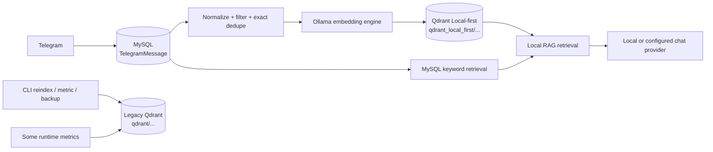
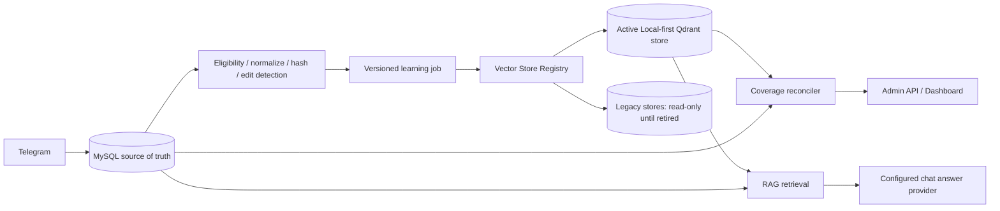

# Đề xuất độ tin cậy kho vector Local-first

**Trạng thái:** thiết kế, chưa triển khai  
**Quyết định release hiện tại:** **NO-GO**  
**Phạm vi:** Local-first embedding, Qdrant, learning job, telemetry, recovery và dashboard.  
**Không thuộc phạm vi:** tự đổi provider/model, tự reindex, xóa dữ liệu, hay thay đổi Telegram permissions.

## 1. Executive summary

UAT V3 xác nhận dashboard đã hiển thị một nguồn test từ `276 MySQL / 257 vector` thành `276 MySQL / 41 vector` sau khi xác nhận learning job. Cùng job hiển thị `Completed 100%` và `Processed / total = 41 / 266`.

### Kết luận dựa trên code

| Nhận định | Mức độ chắc chắn | Bằng chứng |
|---|---|---|
| Job card báo tiến độ sai ngữ nghĩa | Đã chứng minh | Backend đặt `processed = indexed`, `total = len(rows)`, nhưng ép completed thành 100%. |
| UI không giải thích phần không tạo vector | Đã chứng minh | Payload có `vectors_reused`, `messages_filtered`, `messages_duplicate`; card chỉ hiện processed, total, sync và vectors created. |
| Runtime RAG dùng một local vector store khác với một số CLI/metric | Đã chứng minh | Runtime dùng `resolved_local_embedding_qdrant_path`; CLI/metric/backup dùng `resolved_active_qdrant_path`. |
| Flow learning thường trực xóa 216 vector | Chưa chứng minh | Indexer chỉ `upsert`; hàm delete tồn tại riêng và không được gọi bởi flow learning bình thường. |
| `257 -> 41` là count stale hoặc collection mismatch | Khả năng cao | Job gọi `refresh_source_usage` rồi ghi `KnowledgeSource.vector_count` bằng count của Local-first store hiện hành. |

Root cause có khả năng cao nhất là **split-brain vector-store contract**: Local-first được đưa vào runtime nhưng các metadata, CLI, metric, backup và count legacy không được chuyển sang cùng contract. Learning job là thời điểm ghi đè count đã lưu bằng count từ local store đang dùng, nên dashboard phát hiện chênh lệch muộn. Đây vẫn là P0 vì active RAG coverage, metadata và UI không đáng tin cậy.

Không được coi số 257 là coverage Local-first cho đến khi reconciliation xác nhận collection/model/version tương ứng. Không được coi 41 là mất dữ liệu vật lý cho đến khi đọc được cả legacy store và Local-first store theo cùng `chat_id`.

## 2. Kiến trúc hiện tại



### Current path consumers

| Consumer | Current path | Problem |
|---|---|---|
| `Application.rag.vectors` | `resolved_local_embedding_qdrant_path` | Correct Local-first active corpus. |
| Learning refresh and source usage | `self.rag.vectors` | Correctly reads active runtime store, but overwrites stale persisted counts without provenance. |
| Runtime storage metric | `resolved_active_qdrant_path` | Wrong when chat provider is OpenAI/OpenRouter. |
| Control Bot storage metric | `resolved_active_qdrant_path` | Same mismatch. |
| CLI `reindex` | `resolved_active_qdrant_path` | Can rebuild an old/cloud-oriented collection instead of active Local-first corpus. |
| CLI backup metadata | `resolved_active_qdrant_path` | Backs up/reports the wrong collection metadata. |
| Dashboard inventory | `KnowledgeSource.vector_count` persisted in MySQL | Does not prove which collection/model/version generated the count. |

### Immediate design rule

`resolved_active_qdrant_path` must be retired from semantic-index operations. It may remain only as an explicit read-only `legacy_store_path` during migration. A semantic operation must resolve a store through one registry service, never through provider-dependent properties.

## 3. Target architecture



### Vector Store Registry

Add a durable registry. Suggested tables:

#### `vector_stores`

| Field | Purpose |
|---|---|
| `store_id` UUID | Immutable identity, used by jobs and source coverage. |
| `path` | Canonical absolute Qdrant path; unique. |
| `collection_name` | Qdrant collection. |
| `provider` | Must be `ollama` for active Local-first stores. |
| `embedding_model`, `dimension`, `embedding_version` | Compatibility contract. |
| `state` | `active`, `legacy_read_only`, `building`, `retired`, `failed`. |
| `created_at`, `activated_at`, `retired_at` | Lifecycle audit. |
| `last_health_checked_at`, `last_reconciled_at` | Operational freshness. |
| `metadata_json` | Safe migration provenance; never secrets. |

Unique constraints: `(path, collection_name)` and one `state=active` store for the Local-first corpus.

#### `vector_source_coverage`

One row per `(store_id, chat_id)`:

| Field | Purpose |
|---|---|
| `eligible_messages` | Current MySQL rows eligible under source policy. |
| `indexed_vectors` | Exact Qdrant count for this store and source. |
| `indexed_new`, `reused_existing`, `filtered`, `duplicate`, `skipped`, `failed` | Last learning outcome. |
| `checkpoint_message_row_id` | Checkpoint scoped to store/model/version. |
| `coverage_state` | `healthy`, `partial`, `stale`, `mismatch`, `reconciliation_required`. |
| `last_reconciled_at`, `last_learning_job_id` | Traceability. |

`KnowledgeSource` remains an owner-facing inventory summary, but its vector count must be derived from the active coverage row; it cannot be an unqualified source of truth.

## 4. Backend contract

### 4.1 Single store resolver

Introduce `VectorStoreRegistryService.resolve_active_local_store()`.

- Runtime startup resolves exactly one active Local-first store.
- RAG, learning, cleanup, metrics, backup, health, CLI reindex and dashboard obtain their store from this resolver.
- OpenAI/OpenRouter only affect chat completion routing. They never select an embedding store.
- Legacy paths are registered `legacy_read_only`; no automatic write/delete is permitted.

Expected module changes:

| Module | Change |
|---|---|
| `config.py` | Replace ambiguous provider-based active path usage with registry bootstrap config only. |
| `runtime.py` | Resolve registry store before making `LocalVectorStore`; pass `store_id` to jobs. |
| `cli.py` | Reindex must resolve active registry store and local Ollama embedding engine. |
| `control_bot.py` | Metrics must use registry active store. |
| `services/operations.py` | Refresh coverage for a `(store_id, chat_id)`; do not overwrite an unqualified count. |
| `admin_api/app.py` | Return active/legacy/expected coverage separately. |

### 4.2 Incremental learning is append/upsert only

The learning path must obey these rules:

1. Read source policy and resolve a fixed `store_id` at job creation.
2. Acquire a per-source/store lock.
3. Persist the job phase/checkpoint before remote Ollama work.
4. Evaluate each candidate once and classify it.
5. Upsert only message IDs eligible for the fixed store/model/version.
6. Advance checkpoint only after the batch is durably written to Qdrant and MySQL state is committed.
7. Never decrease coverage during ordinary learning.

Only these explicit actions may reduce active vector count: confirmed source deletion, confirmed retention cleanup, confirmed model/store retirement, or a recovery operation that atomically switches to a fully built replacement store.

### 4.3 Edited messages

When Telegram emits an edit:

- retain `TelegramMessageVersion` as today;
- compare normalized content hash with prior hash;
- if changed, mark the old embedding `stale` for its specific `store_id` and enqueue a `reembed_message` task;
- upsert the same Qdrant point ID only after new vector generation succeeds;
- preserve the old point until replacement is successful, then replace atomically by point ID.

Do not rely on `id > checkpoint` alone for edits because an edit has an old MySQL row ID.

### 4.4 Retry and restart behavior

- MySQL deadlock: retry transactional unit up to 3 times with jittered exponential backoff; do not advance checkpoint before successful commit.
- Ollama failure: mark affected batch `retryable`, preserve existing point and checkpoint, retry with bounded backoff.
- Qdrant failure: do not mark messages indexed; preserve the prior coverage row and job as `failed` or `reconciliation_required`.
- Worker restart: reclaim only jobs whose lease expires; resume from committed batch/checkpoint, not from a speculative in-memory progress value.

## 5. Learning job progress contract

Replace ambiguous fields with the following payload contract:

```json
{
  "phase": "embedding",
  "candidates_total": 266,
  "evaluated": 266,
  "indexed_new": 41,
  "reused_existing": 0,
  "filtered": 203,
  "duplicate": 22,
  "skipped": 0,
  "failed": 0,
  "mysql_before": 276,
  "mysql_after": 276,
  "vectors_before": 41,
  "vectors_after": 82,
  "checkpoint_before": 140000,
  "checkpoint_after": 140266,
  "active_vector_store_id": "uuid",
  "embedding_provider": "ollama",
  "embedding_model": "nomic-embed-text:latest",
  "embedding_version": "local-v1",
  "duration_ms": {"sync": 0, "embedding": 3100, "total": 3400}
}
```

Mandatory invariant:

```text
evaluated = indexed_new + reused_existing + filtered + duplicate + skipped + failed
```

Additional invariants:

```text
vectors_after >= vectors_before
  unless job contains an explicit, confirmed reduction reason

checkpoint_after >= checkpoint_before
  and only advances after indexed/reused/filtered classification is durable
```

### Status semantics

| Status | Meaning |
|---|---|
| `queued` | No network/storage work begun. |
| `syncing` | Telegram → MySQL incremental sync active. |
| `embedding` | Candidates are being classified/indexed into fixed `store_id`. |
| `completed` | All invariants pass and coverage has no unexpected reduction. |
| `completed_with_warning` | Work finished but coverage is partial/stale or reconciliation is required. |
| `failed` | A durable phase failed; checkpoint/previous coverage kept. |
| `reconciliation_required` | Store mismatch, unexpected drop, missing points or incompatible metadata found. |

The dashboard must never infer `100%` only from `status === completed`. It may display `pipeline complete` separately from coverage completion.

## 6. Reconciliation and recovery

### Read-only coverage check

Add `POST /api/v1/knowledge/sources/{chat_id}/coverage-check` as a read-only job or synchronous bounded operation.

It must report:

- active `store_id`, path, model, dimension and version;
- all legacy stores known for the source;
- MySQL text messages and policy-eligible messages;
- message IDs marked indexed for the active store;
- Qdrant reference IDs present for the active store;
- orphan Qdrant points and rows marked indexed but absent from Qdrant;
- `expected`, `active`, `legacy`, coverage percentage and mismatch reason.

No write to Qdrant or MySQL occurs during this operation except an audit/reconciliation report record.

### Safety threshold

If `vectors_after < vectors_before` and no confirmed reduction action exists:

1. mark coverage `reconciliation_required`;
2. do not show green `completed`;
3. create audit warning and SSE event;
4. expose a recovery preview, but do not execute it.

### Recovery preview

`POST /api/v1/knowledge/sources/{chat_id}/recover-index-preview` returns:

- eligible count and estimated batches/tokens;
- active store metadata;
- current active and legacy coverage;
- affected messages and expected vector count;
- whether recovery is append-only or needs a new replacement store;
- warning that vectors are derived data and MySQL remains unchanged.

Owner confirmation creates a `recover_source_index` job. It must build into a new `building` store or an isolated staging collection when replacement is required. Only after reconciliation succeeds may the registry atomically activate the replacement store. Legacy data remains read-only until the owner separately retires it.

### Rollback model

- **Append-only repair:** cancel job; old active points remain usable.
- **New-store rebuild:** keep existing active store until replacement passes reconciliation; rollback means retaining the previous active registry row.
- **Confirmed deletion/retention:** cannot restore derived vectors except by rebuilding from retained MySQL. If MySQL content was deleted, recovery is impossible without backup.

## 7. Dashboard UX proposal

### Source detail

Show four separate values:

| Field | Meaning |
|---|---|
| Active vectors | Qdrant count in the registry active Local-first store. |
| Expected eligible messages | MySQL candidates after current policy/filter. |
| Legacy vectors | Read-only count in retired/migrating stores; never used by Local-first RAG. |
| Coverage | `active indexed / expected eligible`, timestamped. |

Example warning:

> **Cần đối soát kho vector.** Local-first đang có 41 vector; kho legacy có 257. Kho legacy không được dùng cho Local-first RAG. Chưa có dữ liệu nào bị xóa.

### Learning job card

Replace `Processed / total` with `Đã đánh giá / ứng viên`. Show `Tạo mới`, `Tái dùng`, `Lọc`, `Trùng`, `Bỏ qua`, `Lỗi`, vector before/after and active store model/version. The visible counts must satisfy the invariant.

### Error behavior

- 401: clear local optimistic state, navigate to login and explain session expired.
- 403 CSRF: restore server state, toast `Phiên ghi đã hết hạn hoặc CSRF không hợp lệ`, offer retry after session refresh.
- Ollama pull validation: map invalid model/registry/network/daemon errors to actionable 4xx/5xx messages; do not expose only `HTTP 500`.
- Telemetry: render Local, Cloud and Legacy separately, plus `unattributed` when historic rows lack provider metadata. Total must equal the sum of buckets.

## 8. Phased implementation plan

### Phase 0 — Freeze and observe

- **Changes:** add read-only diagnostic command/API only; capture registry candidates and counts.
- **Migration:** none, or append-only diagnostic table.
- **Risk:** read-lock/load on Qdrant; rate-limit scans.
- **Rollback:** remove diagnostics; no data mutations.
- **Tests:** count active and legacy stores for test source; verify no Qdrant mutation.
- **Done when:** root cause is classified as stale count, store mismatch, true missing points, or a combination.

### Phase 1 — Registry and unified resolver

- **Modules:** `config.py`, new `services/vector_registry.py`, `runtime.py`, `cli.py`, `control_bot.py`, metric/backup services.
- **Migration:** `vector_stores`, `vector_source_coverage`; backfill registry rows as `legacy_read_only` and one `active` local store.
- **Risk:** wrong initial active designation.
- **Rollback:** registry state change only; legacy paths untouched/read-only.
- **Tests:** runtime, CLI, backup and metric resolve the same active `store_id` when provider is OpenAI/OpenRouter/Ollama.
- **Done when:** no semantic operation uses `resolved_active_qdrant_path` directly.

### Phase 2 — Correct job contract and UI

- **Modules:** `runtime.py`, admin job serializer, `KnowledgeView.jsx`, SSE payloads.
- **Migration:** optional JSON job payload normalization; no destructive schema change.
- **Risk:** old jobs lack fields; render `unknown/legacy` explicitly.
- **Rollback:** backward-compatible serializer retains old payload display.
- **Tests:** invariant tests, completed-with-warning, failed batch, paused/resumed job, mobile card rendering.
- **Done when:** all job cards reconcile counts and do not force 100% incorrectly.

### Phase 3 — Reconciliation report

- **Modules:** `services/coverage.py`, vector store wrapper, admin API, dashboard source detail.
- **Migration:** reconciliation/audit table if persistent history is desired.
- **Risk:** expensive reference-ID scans; paginate and schedule per source.
- **Rollback:** disable endpoint/job; no data changes.
- **Tests:** exact coverage, orphan points, stale DB state, mismatched model/version, legacy-only source.
- **Done when:** source test has a read-only report explaining 41 versus 257.

### Phase 4 — Recover test source

- **Modules:** pending action service, learning worker, dashboard preview/confirmation UI.
- **Migration:** add `recover_source_index` job type and `building` store state if required.
- **Risk:** Ollama capacity, partial store build, accidental model/path switch.
- **Rollback:** cancel staged build; retain current active store and all legacy stores.
- **Tests:** preview/cancel/confirm/audit, recovery retry, no decrement of active coverage.
- **Done when:** owner explicitly confirms, recovery produces an auditable healthy active coverage report, and `/ask` regression passes.

### Phase 5 — Migrate all learned sources

- **Modules:** scheduler fairness, bulk planner, registry/coverage services.
- **Migration:** no destructive migration; registry rows and coverage snapshots only.
- **Risk:** local resource exhaustion and Telegram/Ollama throttling.
- **Rollback:** pause queue; keep old active store; never auto-retire legacy store.
- **Tests:** 298-source dry run, pause/resume, fairness, restart, quota and retention boundaries.
- **Done when:** every learned source has a coverage state and no unexplained count reduction.

### Phase 6 — Release regression gate

- **Tests:** full UAT, desktop/mobile, API auth/CSRF, local/cloud/legacy telemetry, source recovery, `/ask` scope/citations, edit/reembed, dedupe, restart recovery.
- **Done when:** all P0/P1 issues closed and UAT is at least `READY WITH CONDITIONS` with explicit owner acceptance.

## 9. Test plan

### Unit

- Store resolver returns same Local-first store regardless of chat provider.
- Job invariant holds across indexed/reused/filtered/duplicate/skipped/failed cases.
- Edited message produces stale/reembed task without losing previous usable point.
- No ordinary incremental path calls `delete_reference_ids`.
- Retention/deletion actions require explicit confirmed reduction reason.

### Integration

- Learning job uses fixed `store_id`; restart at each phase preserves checkpoint and coverage.
- Qdrant failure does not advance checkpoint or reduce current coverage.
- MySQL deadlock retry succeeds without duplicate vectors.
- Legacy and Local-first stores have separately reported counts.
- CLI reindex writes only to active registry Local-first store with Ollama embedding engine.

### Migration

- Upgrade creates registry rows without moving/deleting vectors.
- Existing `KnowledgeSource.vector_count` becomes `legacy/unverified` until reconciled.
- Downgrade is metadata-only and cannot delete Qdrant directories.

### UAT regression

- Create a source learning job where some messages are duplicate/filtered; card sums to total.
- Verify active count cannot silently drop.
- Test source coverage check and cancel recovery preview.
- After approved recovery, test group `/ask`, member history, group topic, source scope and citations.
- Verify 401/403 rollback and mobile ESC/touch targets after UI fixes.

## 10. Decisions requiring owner approval

1. Which existing Qdrant directory is legacy and which registry row becomes active after Phase 0 reconciliation.
2. Whether legacy vector stores may remain on disk for a retention period and its duration.
3. The coverage warning threshold (recommended: any unexplained decrease is blocking; below 95% eligible coverage is warning).
4. Whether recovery builds a replacement collection or appends to the verified Local-first collection.
5. Cost/resource ceiling for source-test recovery and later bulk migration.
6. Approval to run recovery only after preview reports expected scope and model/version.
7. Approval to retire/delete a legacy store only after all sources are reconciled and backup policy is satisfied.

## 11. Recommendations

- **Recovery source test:** **NO-GO now.** First run Phase 0 and Phase 3 read-only reconciliation; do not reindex blindly into an ambiguous store.
- **Release:** **NO-GO.** The product cannot claim a reliable knowledge brain until collection identity, coverage and job truthfulness are fixed.
- **Next safe action:** implement/read the reconciliation report, not recovery. It changes neither Telegram data nor Qdrant content and will establish whether the 257 vectors are legacy, stale metadata or actually missing.
