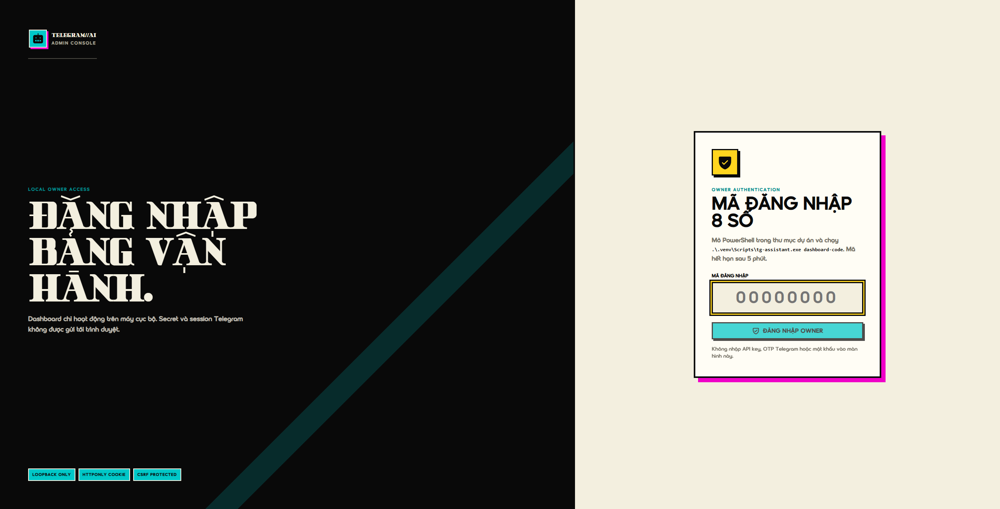
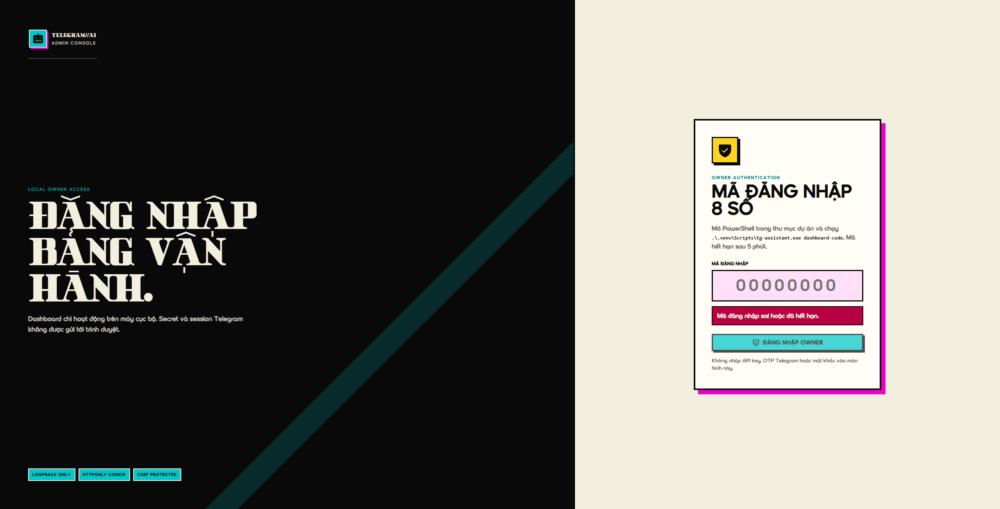
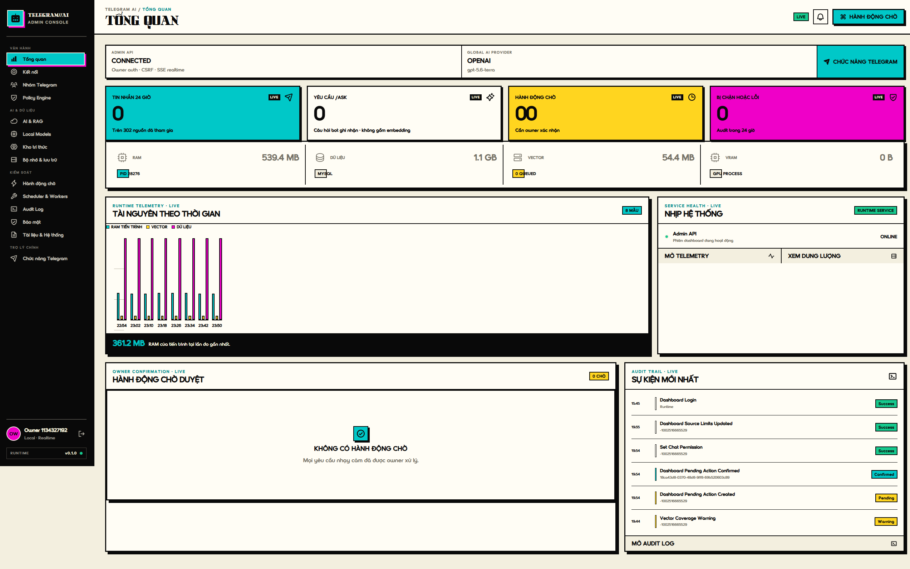
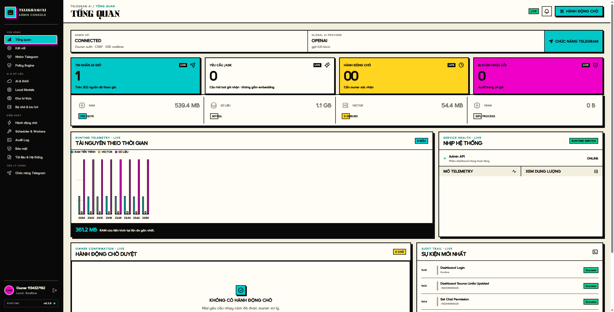
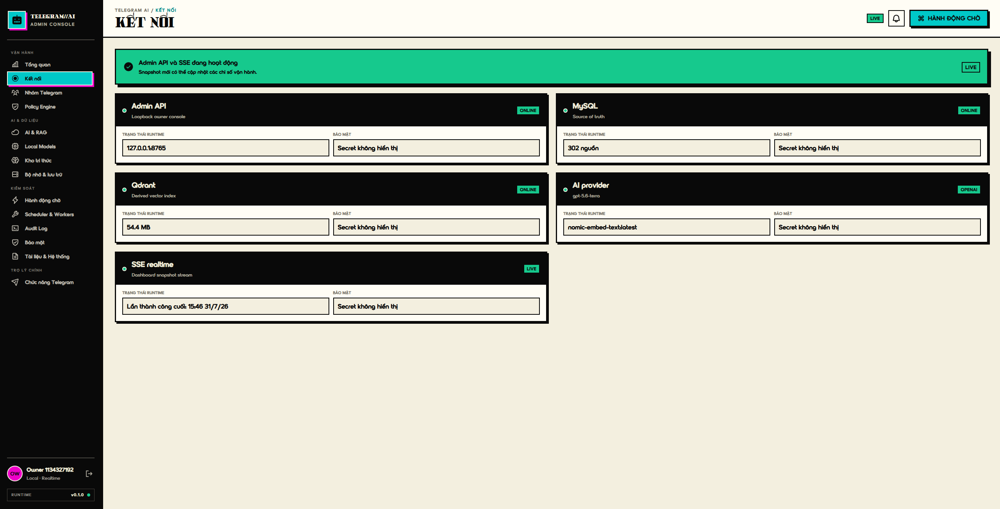
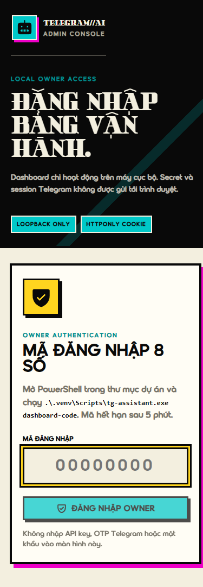

# Đánh giá flow đăng nhập — 31/07/2026

## Kết luận

**PARTIALLY READY.**

Flow đăng nhập hiện tại đủ an toàn và hoạt động tốt cho **một owner đã thiết lập dự án trên máy này**. Flow chưa phù hợp để phát hành cho người dùng phổ thông, chưa hỗ trợ thiết lập lần đầu bằng dashboard và chưa có khả năng chuyển đổi tài khoản Telegram.

## Phạm vi

- Dashboard production local tại `http://127.0.0.1:8765`.
- Đăng nhập mã 8 số, lỗi mã, phiên sau reload, trang Kết nối, đăng xuất và responsive 390 px.
- Đối chiếu frontend, Admin API, CLI setup và model `TelegramAccount`.
- Không reset cấu hình hiện tại, không đăng nhập lại Telegram và không thay đổi dữ liệu Telegram.

## Các bước đã kiểm tra

| Bước | Nội dung | Sức khỏe |
|---|---|---|
| 1 | Khởi động runtime và mở dashboard | Cần cải thiện |
| 2 | Màn hình đăng nhập owner | Khá tốt, còn ma sát |
| 3 | Nhập mã sai | Tốt, còn một lỗi trạng thái |
| 4 | Nhập mã đúng và vào dashboard | Đạt |
| 5 | Reload vẫn giữ phiên | Đạt |
| 6 | Nhận diện/chuyển tài khoản Telegram | Chưa có |
| 7 | Đăng xuất và thu hồi phiên | Đạt |
| 8 | Màn hình đăng nhập mobile 390 px | Đạt có điều kiện |

## Bằng chứng theo flow

### 1. Màn hình đăng nhập

Điểm tốt:

- Mục tiêu chính và ô mã 8 số rõ ràng.
- Input chỉ nhận số, có label, `autocomplete="one-time-code"` và tự focus.
- Không yêu cầu API key, OTP hay mật khẩu Telegram trong trình duyệt.

Rủi ro:

- Người dùng vẫn phải mở PowerShell và chạy một lệnh dài.
- Không có nút sao chép lệnh hoặc hướng dẫn khi không tìm thấy executable.
- Các nhãn `OWNER AUTHENTICATION`, `LOOPBACK`, `CSRF` phù hợp kỹ thuật nhưng chưa thân thiện với người dùng phổ thông.

### 2. Mã sai

Điểm tốt:

- Lỗi hiển thị ngay cạnh input và có `role="alert"`.
- Mã bị xóa sau khi thất bại; backend giới hạn 5 lần thử/phút.

Lỗi:

- Khi người dùng nhập mã mới, thông báo “Mã đăng nhập sai hoặc đã hết hạn” và trạng thái `aria-invalid` vẫn còn cho tới lần submit tiếp theo. Điều này làm mã mới trông như đã bị kết luận sai trước khi gửi.

### 3. Đăng nhập thành công

Điểm tốt:

- Chuyển thẳng vào Tổng quan.
- API trả cookie HttpOnly; thao tác ghi dùng CSRF.
- Owner và trạng thái realtime xuất hiện ngay.

Rủi ro:

- Sidebar chỉ hiện `Owner <ID>`, không cho biết tên, username, số điện thoại che bớt hoặc tài khoản Telegram nào đang được dùng.

### 4. Phiên sau reload

- Reload vẫn nhận diện phiên đúng.
- Test backend liên quan login/session đạt `2 passed`.
- Session hiện tồn tại trong bộ nhớ runtime; restart backend sẽ buộc đăng nhập lại nhưng UI chưa giải thích điều này.

### 5. Trang Kết nối

Đây hiện là trang health của Admin API, MySQL, Qdrant, AI provider và SSE. Trang có các ô mang nhãn `Bảo mật`, nhưng chúng là input `readOnly` chỉ hiển thị câu `Secret không hiển thị`; không có endpoint ghi secret từ màn hình này. Do kiểu trình bày giống input chỉnh sửa nên người dùng có thể hiểu nhầm rằng đây là phần cấu hình.

Trang không có:

- Tài khoản Telegram đang hoạt động.
- Thêm/kết nối lại tài khoản.
- Chuyển tài khoản.
- Xác nhận ảnh hưởng tới sync, job và kho tri thức.

Tên “Kết nối” vì vậy dễ làm người dùng kỳ vọng đây là nơi quản lý Telegram account.

### 6. Đăng xuất

- Đăng xuất thu hồi session và quay về login ngay.
- Không còn truy cập dashboard bằng phiên cũ.

### 7. Mobile 390 px

- Không bị tràn ngang và CTA đủ lớn.
- Nội dung dài hơn một viewport nên cần cuộn.
- Nhãn bảo mật thứ ba không còn hiển thị ở kích thước này; đây là lỗi nhất quán thông tin, không phải lỗi chặn thao tác.

## Đối chiếu code

### Đã làm đúng

- Admin API chỉ cho đăng nhập từ loopback.
- Mã được tạo bằng HMAC và đổi theo chu kỳ 5 phút.
- Có rate limit đăng nhập.
- Cookie dùng `HttpOnly` và `SameSite=Strict`.
- Thao tác ghi kiểm tra origin và CSRF.
- Logout thu hồi token phía server.

### Chưa đáp ứng flow mong muốn

- Setup lần đầu vẫn chạy hoàn toàn trong terminal trước khi Admin API khởi động.
- OTP/2FA Telegram chỉ có trong bootstrap CLI.
- Chỉ có một file session `account.session.enc`.
- `_is_paired()` lấy một `TelegramAccount` đầu tiên.
- Không có Admin API hoặc UI cho thêm/chuyển tài khoản Telegram.
- Các bảng group/message chưa được phân vùng theo `telegram_account_id`.
- “Mã một lần” thực tế có thể tái sử dụng trong cùng cửa sổ 5 phút để tạo nhiều session.

## Ưu tiên sửa

### P1

1. Thêm `/setup` cho lần chạy đầu và chỉ mở dashboard sau khi Telegram account được xác nhận.
2. Thêm Account Manager trong dashboard: xem tài khoản hiện tại, thêm, kết nối lại, chuyển và thu hồi session.
3. Phân vùng session, chat, message, job, policy và knowledge theo `telegram_account_id`.
4. Hiển thị danh tính Telegram đang hoạt động ở sidebar/header.

### P2

1. Biến mã đăng nhập thành token dùng đúng một lần hoặc không gọi nó là “mã một lần”.
2. Xóa lỗi ngay khi người dùng bắt đầu sửa mã.
3. Thêm nút copy lệnh và hướng dẫn recovery khi executable không được nhận diện.
4. Đổi tên trang hiện tại thành “Hạ tầng kết nối”, hoặc bổ sung Telegram Account vào trang đó.
5. Hiển thị thời hạn phiên và thông báo rõ khi runtime restart làm mất phiên.

## Giới hạn bằng chứng

- Máy đã được cấu hình nên không reset để chụp flow setup lần đầu; phần này được đối chiếu trực tiếp từ code CLI.
- Không đăng nhập Telegram lại vì có thể ảnh hưởng session thật.
- Chưa kiểm thử bằng screen reader; đánh giá accessibility dựa trên DOM, keyboard affordance và ảnh chụp.
